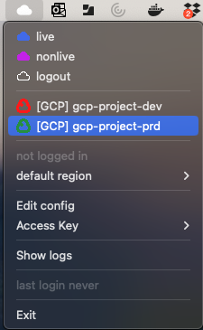

# logsmith
Logsmith is a desktop trayicon to assume your favorite aws roles.

```
“Who are you and how did you get in here?” -
”I'm a locksmith and i'm a locksmith”

- Police Squad! (1982)
```
 
## What does logsmith do?


- switch profiles 
- switch regions
- keeps you logged in
- removes unused profiles  
- icon will change color. You see which profiles you are using
- set and rotate access key
- fetches mfa token for you
- has a graphical user interface and a cli

## Config
The config will be stored in `${HOME}/.logsmith/accounts.yaml` and should look like this:
```yaml
productive:                   
  team: team1                 
  region: eu-central-1         
  color: '#388E3C'            
  profiles:
    - profile: nonlive            
      account: '123456789123'   
      role: developer         
      default: true            
    - profile: live
      account: '123456789123'
      role: developer
```

If you have account ids with leading zeros, please make sure to put them in quotes.

### Chain Assume
You may add a "source" profile which will be used to assume a given role.

This is useful when your own user account can not assume service specific roles. 

```yaml
productive:                   
  team: team1                 
  region: eu-central-1         
  color: '#388E3C'            
  profiles:
    - profile: developer            
      account: '123456789123'   
      role: developer-role         
    - profile: service
      account: '123456789123'
      role: service-role
      source: developer
```
In this example, logsmith will first assume the role 'developer-role', write the credentials in profile 'developer' and the uses the said profile to assume the role 'service-role'.

Please keep in mind that the roles will be assumed in the given order.

## Access key
Please use the dialog option provided by logsmith to set your access key or save it in `.aws/credentials` 
under the profile name *access-key*.

```config
[access-key]
aws_access_key_id = blablubb
aws_secret_access_key = supersecret
```

## Switching region
Logsmith will use the `.aws/config` to set your region independent of your credentials in `.aws/credentials`. 

```config
[profile nonlive]
region = eu-central-1
output = json
```

The region in your config will be used if you don't specify a region in your aws cli call or set AWS_REGION environment variable.

## Mfa token
Logsmith can fetch mfa tokens from your yubikey if you have a suitable cli tool installed.

For example:
- ykman (mac)
- yubioath (linux)

On the logsmith config dialog, you can specify the appropriate command to fetch the token. Your command should return the 6 digit code.
Please also keep in mind that you might have to provide the whole path/command.

Example:
`/usr/local/bin/ykman oath code  | awk 'NF>1{print $NF}'` .

## Group file
Logsmith will write the active profile group to `${HOME}/.logsmith/active_group`. This could be used to include the current profile group in your shell prompt.

Example:
```bash
some_directory [master] (production) %
```

## Cli
If you provide one of the following parameter logsmith will automatically start in cli mode:
```bash
  --list                lists profile groups
  --login LOGIN         Login with group
  --logout              Remove profiles
  --region REGION       Overwrite region to login to
  --set-access-key      set access key
  --rotate-access-key   rotate access key
  -o --oneshot          exit after login
```

Example to login with cli mode:
```bash
  ./logsmith --login team1
``` 

## How to package
If you want to build a binary, please use the following steps:

```bash
./setup.sh
./package.sh
```

The binary will be in `dist`.

### Mac
For mac, just drop the `dist/logsmith.app` in your application directory.

## Icons


This icon was provided by [game-icons.net](https://game-icons.net/) and was made by [Lorc](http://lorcblog.blogspot.com/) under [CC BY 3.0](http://creativecommons.org/licenses/by/3.0/)

The icons in `app/assets` were provided by [material.io](https://material.io/resources/icons/?style=baseline) and are licenced under [Apache license version 2.0.](https://www.apache.org/licenses/LICENSE-2.0.html) 

## Contribute
logsmith is currently in active development and welcomes code improvements, bug fixes, suggestions and feature
requests. 

For those of your interested, providing documentation to other parties is equally welcome.

Please document all notable changes to this project in the provided changelog under 'Unreleased' with usage of the provided format and categories.

Note that this project adheres to [Semantic Versioning](http://semver.org/).

## Releases
To create a new release, please use the following steps:

- update the CHANGELOG.md with the changes that will be in the release. Please use the provided format and categories to choose the new version number.
- update the version number in `app/__version__.py`.
- create a commit with the new version number as commit message which includes the changes mentioned above.
- tag the commit with the new version number.
- Use the github action to create a release.
- Update the release description with the changes from the CHANGELOG.md.

### Yanking of releases
If a release is broken or contains security issues of any kind, it should be yanked.

If you want to yank a release, please use the following steps:

- update the release version to `yanked-<version>`.
- update github release name accordingly and delete the all uploaded files.
- update CHANGELOG.md accordingly and if possible, provide a reason.
- update commit tag accordingly.

## License
Distributed under Apache License 2.0

## Known issues
[Issues:Bug](https://github.com/otto-de/logsmith/labels/bug)
